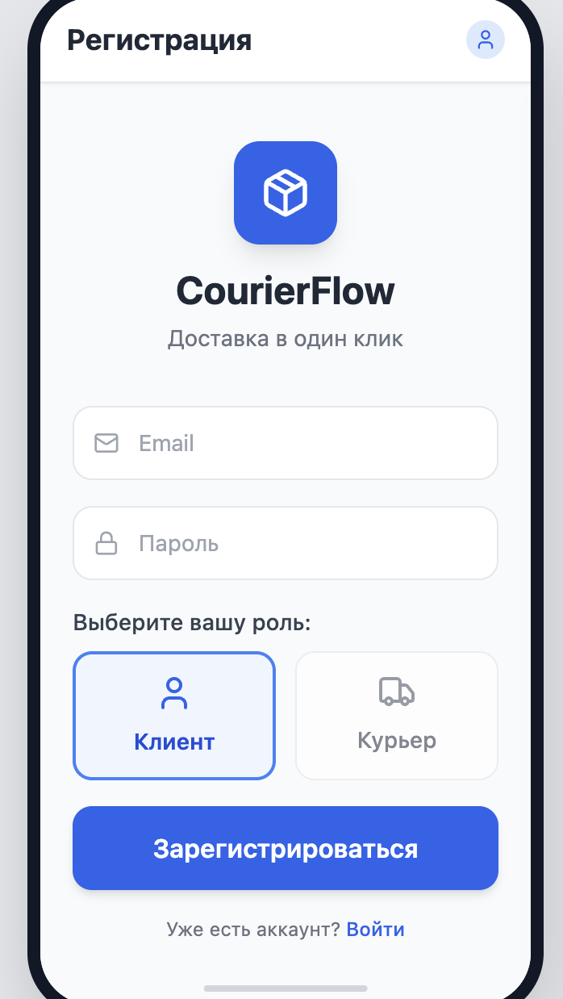
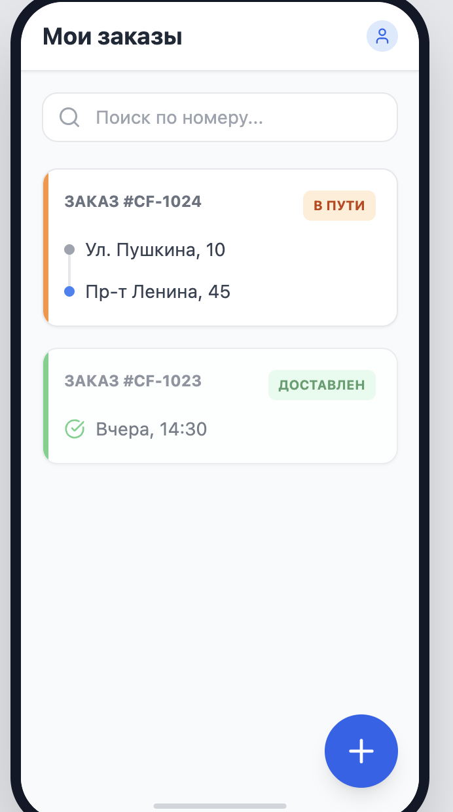
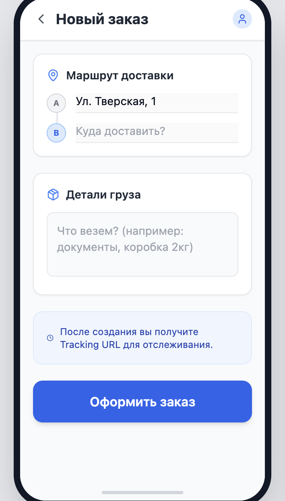
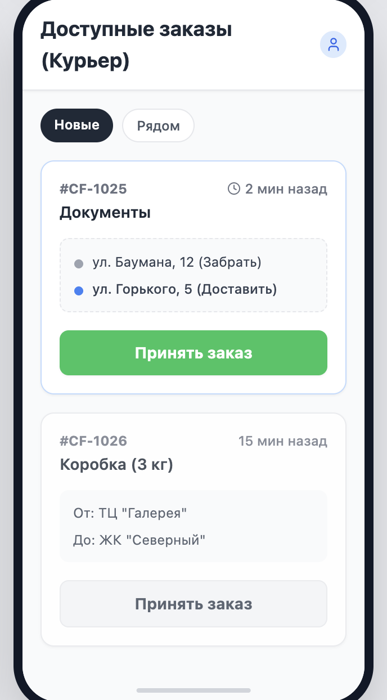
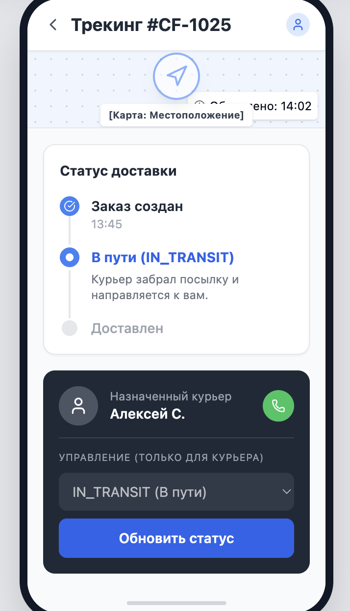

### Экран регистрации позволяет пользователю создать аккаунт, введя данные и выбрав роль.

### Экран списка заказов показывает активные и завершенные доставки клиента с быстрым доступом к созданию нового заказа.

### Экран нового заказа нужен для заполнения маршрута и параметров отправления перед оформлением доставки.

### Экран доступных заказов для курьера отображает новые заявки и дает возможность принять заказ в работу.

### Экран трекинга отображает карту, текущий статус доставки и блок управления/контакта курьера.

