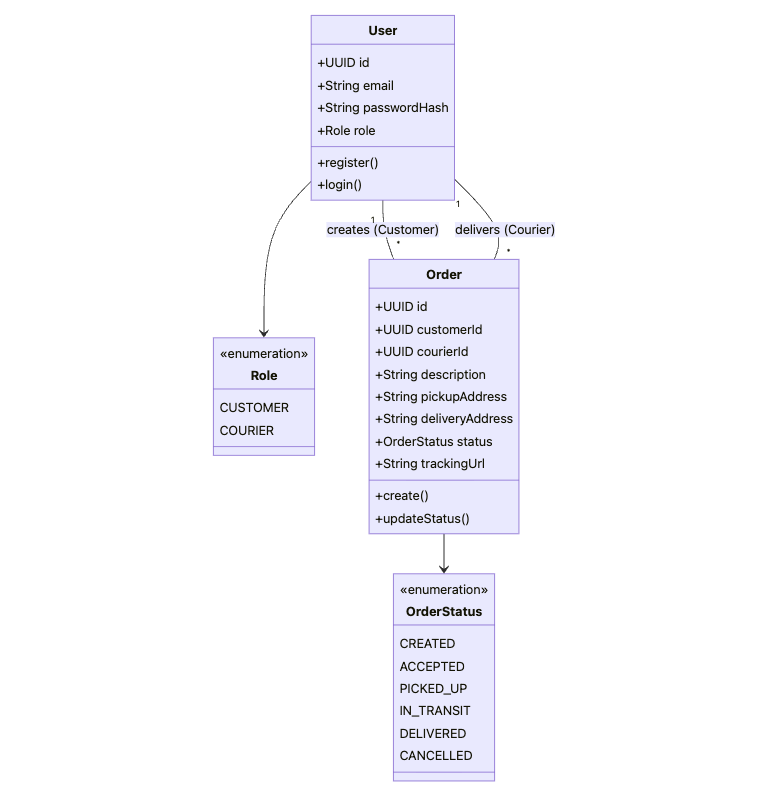
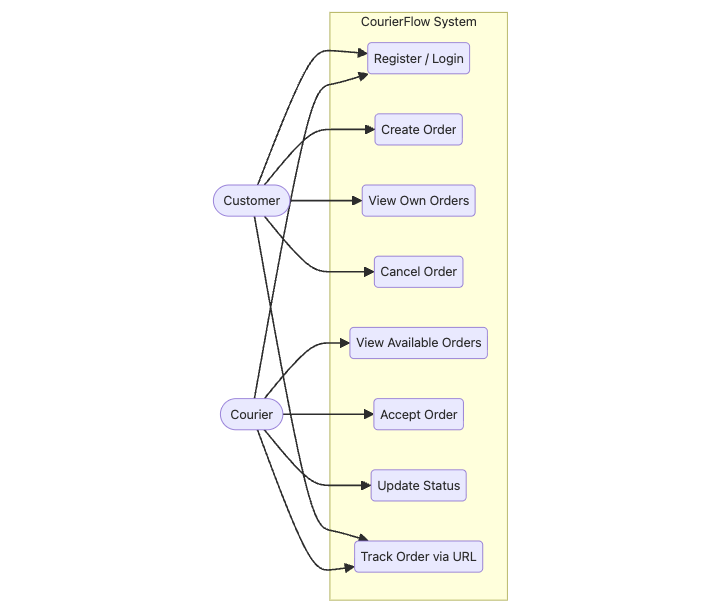
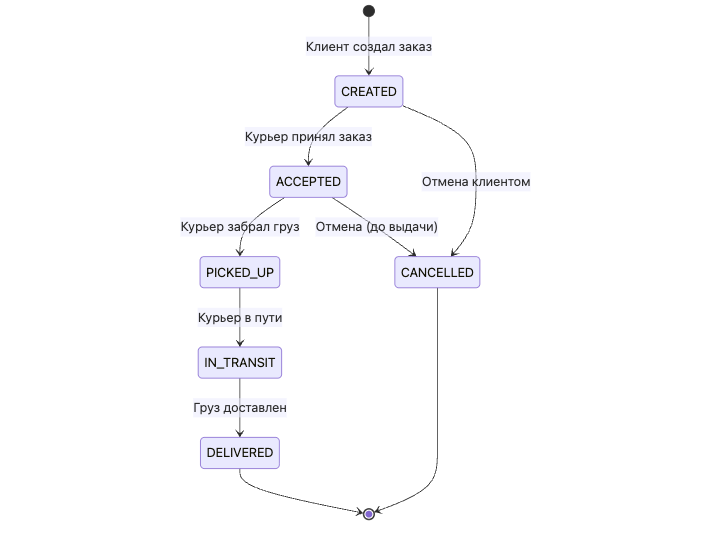
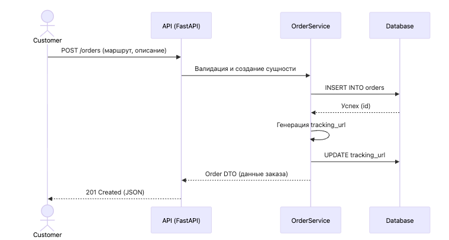
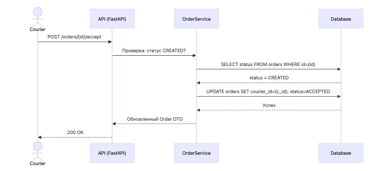
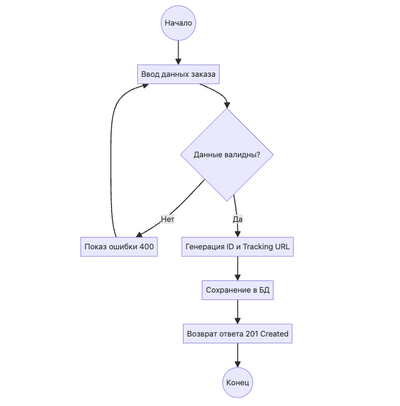
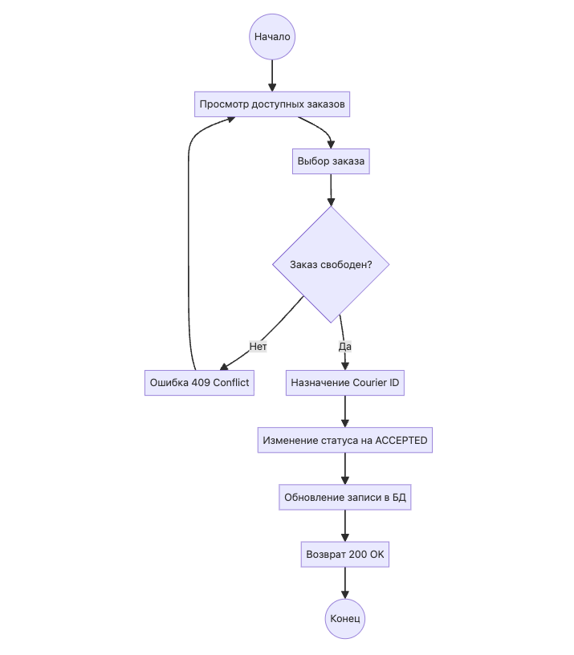
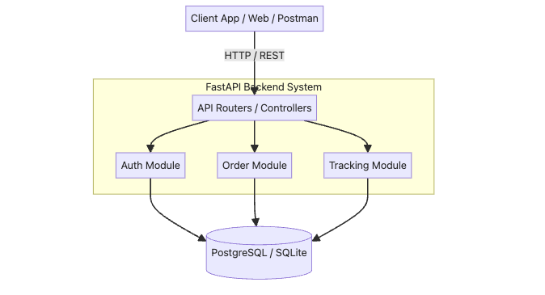
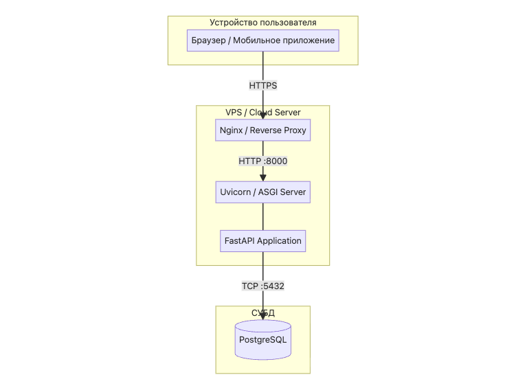

### Диаграмма классов описывает основные сущности системы доставки, их атрибуты и связи между пользователями, заказами и статусами.

### Диаграмма прецедентов показывает действия клиента и курьера в рамках системы CourierFlow.

### Диаграмма состояний отражает жизненный цикл заказа от создания до доставки или отмены.

### Sequence Diagram сценария создания заказа показывает взаимодействие клиента, API, сервиса и базы данных.

### Sequence Diagram сценария принятия заказа показывает путь курьера при назначении и подтверждении заказа.

### Activity Diagram сценария создания заказа отражает шаги клиента от ввода данных до успешного создания.

### Activity Diagram сценария принятия заказа отражает процесс выбора и подтверждения заказа курьером.

### Диаграмма компонентов показывает взаимодействие клиентского приложения, backend-модулей и базы данных.

### Диаграмма развертывания демонстрирует размещение клиента, серверных компонентов и СУБД.

